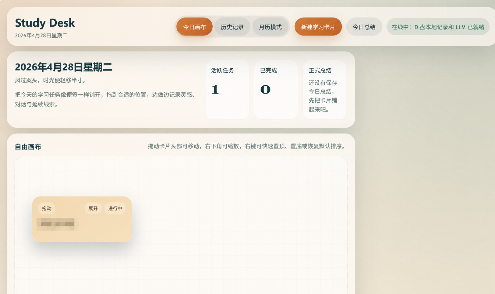
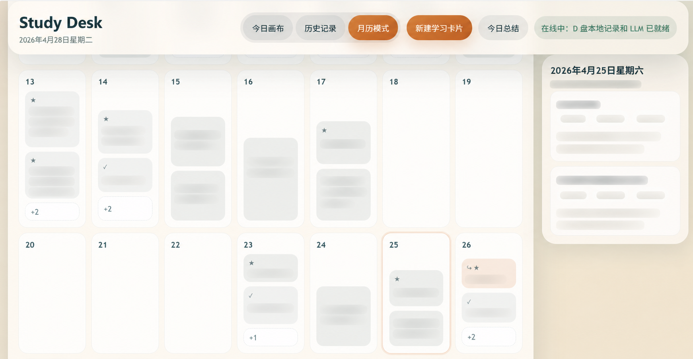

# Study Desk

Study Desk 是一个面向日常学习与轻量项目推进的本地任务工作台。它把“今日执行”“历史回看”“安排到未来日期”“月历聚合”“任务延续线索”“轻量 LLM 辅助”放在同一套前端交互里，目标不是做一个重型项目管理器，而是做一个更贴近真实学习节奏的桌面式工作面板。

这个项目当前采用原生前端 + 本地 Python 服务的结构：

- 前端：`index.html` + `styles.css` + `src/*.js`
- 本地服务：`serve_app.py`
- 数据存储：`data/*.json`
- 手工回归：`tests/manual_smoke_checklist.md`

## 界面预览

### 今日画布



今日画布用于承载当天真正要推进的任务。卡片可以拖动、缩放、置顶、置底，并在右侧详情抽屉里补充 notes、LLM 对话和任务延续信息。

### 月历模式



月历模式用于按整月维度查看：

- 哪些任务是从前一天或其他日期安排过来的
- 哪些任务同时重要且紧急
- 哪些任务已经完成
- 某一天是否有超出首屏显示数量的任务

## 项目目标

Study Desk 关注的是“持续推进”而不是“任务清单堆积”。它试图解决几类常见问题：

1. 今天要做什么，怎么快速铺开并进入状态。
2. 做到一半的任务，明天如何无痛续上，而不是重新回忆上下文。
3. 零散 notes、阶段性结论、LLM 对话、DDL、路径信息，如何和任务本身放在一起。
4. 不同日期之间的任务迁移，如何在未来视角里被看见，而不是淹没在历史里。
5. 一整个月里，哪些天任务堆积、哪些天有高优先任务、哪些天完成度高，如何快速扫一眼。

## 核心功能

### 1. 今日画布

- 新建学习卡片，自动聚焦标题输入框。
- 卡片支持拖拽、缩放、置顶、置底、恢复默认排序。
- 每张卡片包含状态、颜色、重要度、紧急度。
- 任务按优先级自动排序，也支持手动排序覆盖。

### 2. 任务详情抽屉

- 编辑任务标题与状态。
- 调整“重要 / 紧急”优先级。
- 记录零散灵感 Notes。
- 发送任务内 LLM 对话。
- 保存任务延续区信息：
  - 上次进度
  - 相关路径
  - 相关文件
  - DDL

### 3. 安排到指定日期

- 从当前任务生成未来日期的新任务。
- 可只带标题，也可选择性携带上下文。
- 可部分勾选 Notes。
- 可选择是否带上任务延续区字段。
- 可勾选 LLM 对话摘要。
- 可勾选下一步计划。
- 可勾选“一句日历”。
- 新任务会显示 `from 日期` 的来源提示。

### 4. 月历模式

- 以整月网格方式聚合每日任务。
- 每个日期默认展示两条任务。
- 超出部分显示 `+n` 提示。
- 支持三类快速标记：
  - `↪`：安排到未来日期的任务
  - `★`：同时重要且紧急
  - `✓`：已完成任务
- 点击日期打开当天辅助面板。
- 点击任务打开全局详情抽屉。
- `+n` 支持 tooltip 查看隐藏任务。

### 5. 历史记录

- 按日期查看当日已保存任务。
- 查看该日正式总结或草稿总结。
- 回看任务延续信息、notes、对话痕迹。

### 6. 本地 LLM 辅助

- 支持任务内对话。
- 支持对任务对话生成轻量摘要。
- 支持生成“下一步计划”。
- 支持生成当日总结。
- 通过本地服务暴露 `/api/llm` 代理接口。

## 典型工作流

### 工作流 A：今天推进任务

1. 在今日画布新建或打开卡片。
2. 设定状态、优先级和颜色。
3. 在卡片详情里记录 notes 和阶段性结论。
4. 遇到卡点时调用 LLM 辅助。
5. 完成后更新状态或归档。

### 工作流 B：把任务续到明天或未来日期

1. 打开任务详情。
2. 点击 `安排到日期`。
3. 选择目标日期。
4. 勾选要携带的 notes、任务延续字段、LLM 摘要、下一步计划或一句日历。
5. 确认后在目标日期生成新任务。
6. 在历史记录和月历模式中都可以看到这个未来任务。

### 工作流 C：按月观察任务分布

1. 切换到 `月历模式`。
2. 浏览整月任务密度与重要任务分布。
3. 点击某一天，打开右侧辅助面板查看该日概览。
4. 点击具体任务，进入全局详情抽屉继续编辑。

## 项目结构

```text
daily_planning/
├─ data/
│  ├─ tasks.json
│  ├─ notes.json
│  ├─ messages.json
│  ├─ records.json
│  └─ memory_entries.json
├─ docs/
│  ├─ feature_overview.md
│  └─ planning.md
├─ figures/
│  ├─ daily.png
│  └─ calender.png
├─ icons/
├─ src/
│  ├─ app.js
│  ├─ constants.js
│  ├─ db.js
│  ├─ llmAdapter.js
│  ├─ llmConfig.js
│  └─ utils.js
├─ tests/
│  └─ manual_smoke_checklist.md
├─ index.html
├─ styles.css
├─ serve_app.py
├─ sw.js
└─ workflow.md
```

## 前端界面逻辑

### 顶部导航

顶部导航负责三种主视图切换：

- `今日画布`
- `历史记录`
- `月历模式`

另外还提供：

- `新建学习卡片`
- `今日总结`
- 网络 / LLM 状态提示

### 全局布局

页面逻辑上分成三层：

1. 顶部导航栏
2. 主内容区
3. 全局任务详情抽屉

其中任务详情抽屉是全局编辑器，不绑定单个视图：

- 在今日画布里，抽屉用于编辑当天卡片。
- 在月历模式里，抽屉用于打开某个日期中的任务详情。

### 月历模式的 UI 角色分工

月历模式下，界面进一步分为：

- 左侧主区域：整月网格
- 右侧辅助面板：当前选中日期的概览
- 浮出式任务抽屉：深度编辑任务

这种设计的目标是把“浏览日期分布”和“编辑任务细节”分离开：

- 浏览时，优先看月格和辅助面板。
- 需要深度操作时，再打开详情抽屉。

## 数据模型

### 1. 任务

主要保存在 `data/tasks.json`，包含但不限于：

- `id`
- `date`
- `title`
- `status`
- `importance`
- `urgency`
- `orderingMode`
- `color`
- `scheduledDate`
- `arrangedFrom`
- `isArrangedTask`

### 2. Notes

保存在 `data/notes.json`，用于记录：

- 普通灵感
- carryover note
- 一句日历
- 任务摘要文本块

### 3. LLM 对话

保存在 `data/messages.json`，用于记录任务级对话上下文。

### 4. 每日记录

保存在 `data/records.json`，用于保存：

- 总结草稿
- 正式总结
- 生成时间等元数据

### 5. 任务延续区

保存在 `data/memory_entries.json`，用于在跨天推进时保留：

- 上次进度
- 相关路径
- 相关文件
- DDL

## 快速开始

### 运行环境

- Python 3.10+
- 现代浏览器（推荐 Chrome / Edge）

### 启动方式

在项目根目录运行：

```bash
python serve_app.py 4173
```

然后打开：

```text
http://127.0.0.1:4173/index.html
```

### 服务职责

`serve_app.py` 同时承担以下职责：

- 提供静态文件服务
- 暴露本地数据 JSON 的读写 API
- 提供 LLM 代理接口
- 统一前端的数据访问入口

## LLM 说明

前端通过 `src/llmAdapter.js` 调用本地代理接口 `/api/llm`，再由 `serve_app.py` 转发到远程模型服务。

当前 LLM 相关能力包括：

- 任务内对话
- 当日总结
- 安排到日期时的对话摘要
- 安排到日期时的下一步计划

如果本地服务未启动，前端会提示无法连接到 LLM 代理。

## 测试与验收

手工验收清单位于：

- `tests/manual_smoke_checklist.md`

当前手工验收重点覆盖：

- 基础回归
- 安排到指定日期
- 只带标题
- 部分 notes 携带
- 任务延续字段携带
- LLM 对话摘要
- 下一步计划
- 一句日历格式
- 新任务 `from 日期`
- 月历中的 `↪ / ★ / ✓`
- `+n` 数量与 tooltip
- 点击日期打开辅助面板
- 点击任务打开详情
- 旧任务兼容

## 当前实现重点

截至当前版本，项目已经完成或基本完成的能力包括：

- 今日画布主流程
- 历史记录查询
- 安排到指定日期
- 一句日历块写入
- 月历数据聚合
- 月历 UI
- 月历交互
- 手工验收清单 Phase 10 更新

## 已知注意事项

1. 当前仓库中的 LLM 代理配置仍需在公开发布前做一次密钥治理，建议迁移到环境变量或本地私有配置。
2. 月历模式更适合桌面端浏览，移动端已做响应式处理，但仍建议以桌面使用为主。
3. 当前测试以手工 smoke 为主，尚未补齐自动化前端测试。

## 后续可继续扩展的方向

1. 把 LLM 配置彻底改为环境变量 + 本地私有配置文件。
2. 为月历模式增加筛选、搜索与周视图。
3. 为任务延续区增加更多结构化字段。
4. 增加自动化回归测试与截图测试。
5. 提供更稳定的数据导入 / 导出能力。

## 适合谁使用

Study Desk 更适合以下场景：

- 课程学习推进
- 论文 / 小项目并行管理
- 需要跨天续接上下文的任务
- 希望把 notes、路径、DDL 和任务放在一起的人
- 希望用轻量 LLM 辅助，而不是重型协作平台的人

如果你也希望把“今天要推进的事”从一个静态清单，变成一个真正可以滚动、续接、回看的桌面工作流，这个项目就是为此设计的。
